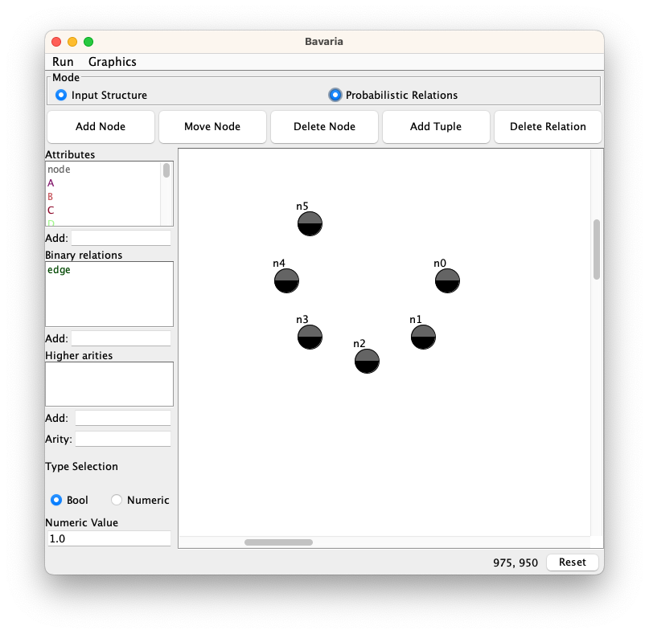
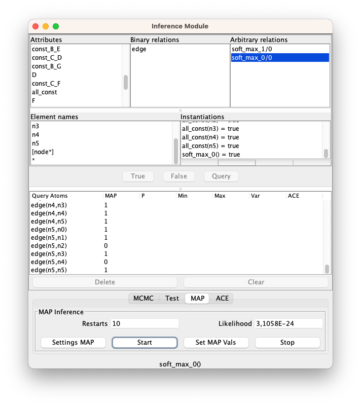
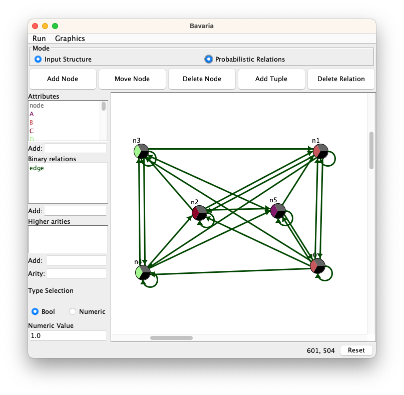
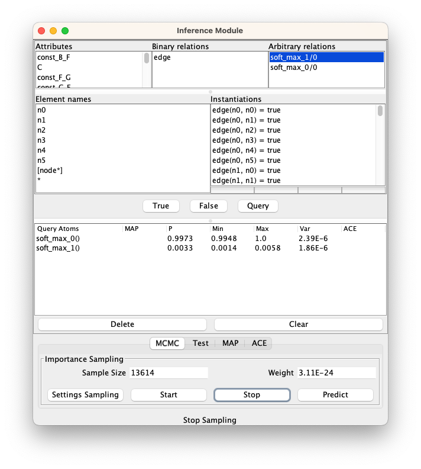

# Primula System: RBN-GNN example

In this example we show how it is possible to work with GNNs and RBNs. The ***.rbn** file is a Relational Bayesian Network that is computationally equivalent to a Graph Neural Network, in particular the architecture used is an ACR-GNN from the [The Logical Expressiveness of Graph Neural Networks](https://openreview.net/forum?id=r1lZ7AEKvB) paper. This RBN contains the weights of a trained ACR-GNN model on a synthetic dataset. This dataset is composed by random graphs, where each node can have 7 different types [A, B, C, D, E, F, G]. Positive graphs have inside two specific motifs: one with a node A connected to two node B (B - A - B), and the other is one node C conneced to two nodes D (C - D - C). We trained a ACR-GNN to classify the two classes obtaining high accuracy (0.9904), and we export the trained model into a computationally equivalent RBN. Edges in the dataset are not directed, and in the RBN definition direction do not have any importance or meaning for the final results. With this trained GNN written into an RBN we can have much more inference power. In this example we will show how this RBN-GNN combiantion can be used as a model-level explainer able to reproduce the most probable graph for a given class.

## Initial settings

Open **Bavaria** from the Modules menu to see the initial graph. Select and activate both the toggles **Input Structure** and **Probabilistic Relations** on the top of the Bavaria's interface. You will see a bunch of nodes with two color: one is for the **Node** attribute, and the other is representing all the **constraints** attribute that we have defined in the **.rdef** file.

<figure align="center">
   
   <figcaption>The Bavaria interface</figcaption>
</figure>

---

**About the constraints:** With RBNs we can impose some constraint for the graph generation during the MAP inference, those constraints in this case are useful to assign an high probability to having assigned only one attribute of the 7 different types for each node. In this case it will very hard to have graphs with multiple or zero types assigned.

---

## MAP inference

### Setting Queries for Attributes or Binary Relations

Open the **Inference Module** from the Modules menu to configure various Attributes or Binary relations (edges) and generate the most probable graph for a given class, using the MAP module.
   
1. **Attribute Queries**:
   - Click the **Query** button to enter in the "query mode", and select the attributes you want to query for each node. In the synthetic example, each node has 7 possible attributes [A, B, C, D, E, F, G]. In order to do this, click on one attribute (e.g. C) and click on the `[node*]` element in the **Element names** list. This assigns the selected Attributes to all nodes.
   - Repeat this process for all 7 attributes (Note: the Query button can only be clicked on the first time).
   
1. **Edge Queries**:
   - Assign all possible edge combinations to the nodes by selecting the edge attribute in the Binary relations list, and double-clicking again on the `[node*]` element (this require to be in the "query mode", click on the Query button to enter in this mode).

### Selecting the Class

- **Choose the Class for Computation**:
   - Set the class for which you want to compute the most probable graph. In the compiled RBN, all positive classes are assigned to the **Arbitrary relation** `soft_max_0/0`, negative to `soft_max_1/0`.
   - Click the **True** button and then click on the `soft_max_0/0` relation to assign it as the true value.


<figure align="center">
   
   <figcaption>The inference module</figcaption>
</figure>   


### Computing MAP

1. **Perform MAP Computation**:
   - Start the MAP computation by clicking the **MAP** button and then clicking the **Settings MAP** button.
   - A new window will open, allowing you to set the number of restarts you want (-1 to stop manually or another value, e.g., 10).
   
2. **Executing MAP Computation**:
   - Click the Start button in the Inference Module and wait for the restarts to complete or manually stop the computation.
   - When the computation finishes, press the **Set MAP Vals** button to apply the computed values to the graph.

### Viewing Results

- **Viewing Computed Values**:
   - View the computed values from Bavaria.
   - Save these results in an .rdef file by clicking on the Primula main interface's **Save Data** option under the **Run** menu.


<figure align="center">
   
   <figcaption>The generated graph</figcaption>
</figure>   

### Additional Analysis

**Perform Additional Analysis**: we can compute the probability that this generated graph for the model directly on the Primula interface. The .rbn file represent the model and we can use the **MCMC** inference module to estimate the probability that the generated graph has on the GNN model with few decimals of error. 

- Open the saved .rdef file computed with the MAP inference with a text editor. This file is an XML-like file with all the attributes specified for the graph. In the ```<ProbabilisticRelsCase>``` there are written all the assignments for the elements in the graph. Look for for the relation ```<d rel="soft_max_0" args="()" val="true"/>``` and delete that from the .rdef file. In this way we are not assign the class to the graph and it will be possible to compute the true probability (otherwise it will be as 1.0 for the assignment).
- Load the modified .rdef file computed with the MAP inference into Primula with the same .rbn of the computation of before.
- Open the **Inference Module** and click on the **MCMC** button.
- Click on the **Query** button to query which class we want to select and click to the `soft_max_0/0` class in the **Arbitrary relations** (it is possible also to click on both the classes to have also the probability of the other class).
- Click on the **Start** button and wait some seconds, the Sample Size will increase and in the Query Atoms it will be possible to see the computed probability under the **P** column.

<figure align="center">
   
   <figcaption>The probability computed for the generated graph using MCMC</figcaption>
</figure> 